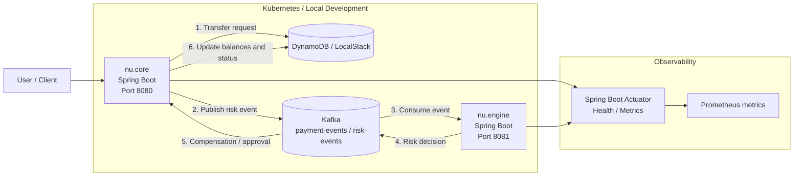
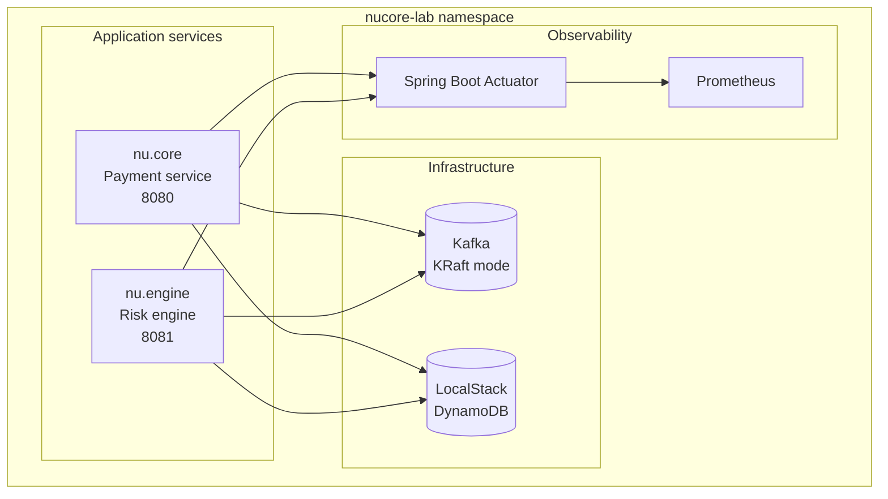

# NU CORE

Payment service that orchestrates transfers between accounts, persists to DynamoDB, and publishes events to Kafka for risk validation (saga). Includes automatic compensation when the risk engine rejects the operation.

---

## Stack and versions


| Component                 | Version           |
| ------------------------- | ----------------- |
| **Java**                  | 21                |
| **Spring Boot**           | 3.4.5             |
| **Spring Kafka**          | (managed by Boot) |
| **AWS SDK DynamoDB**      | 2.28.0            |
| **Micrometer Prometheus** | (managed by Boot) |
| **Testcontainers**        | 1.21.4            |
| **Awaitility**            | (managed by Boot) |


Testcontainers images:

- **Kafka:** `apache/kafka:3.9.2` (KRaft mode; same image as Docker Compose and Kubernetes)
- **LocalStack (DynamoDB):** `localstack/localstack:3.0`

---

## Requirements

- **JDK 21**
- **Maven 3.9+**
- **Docker** (for integration tests with Testcontainers)
- **Docker Desktop (Windows):** enable *"Expose daemon on tcp://localhost:2375 without TLS"* (Settings → General) so integration tests can connect correctly.

For local development without Testcontainers:

- **Kafka** at `localhost:29092` (or set `spring.kafka.bootstrap-servers`)
- **LocalStack** at `http://localhost:4566` for DynamoDB (or leave endpoint empty for real AWS)

---
## Architecture diagram

This diagram summarizes the technology stack and the main application flow:



Kafka is the asynchronous backbone of the saga. `nu.core` publishes a transfer event to the `payment-events` / `risk-events` flow after debiting the origin account, and `nu.engine` consumes that event to evaluate risk rules and return a decision. If the risk engine rejects the operation, the rejection is published back through Kafka so `nu.core` can compensate the transfer and restore the original balance. In this project, Kafka decouples the two services, keeps the transfer flow non-blocking, and acts as the event bus for the saga state changes.

The payment service orchestrates the transfer, persists account data in DynamoDB, and publishes risk events to Kafka. The risk engine consumes those events and drives the saga outcome, while Actuator exposes health and metrics for both services.

---

## Kubernetes cluster overview

The Kubernetes cluster runs the application in the `nucore-lab` namespace and is composed of the infrastructure layer plus the two Spring Boot services. Kafka and LocalStack provide the internal event bus and DynamoDB emulation, while the payment service and risk engine communicate through Kafka and share the same observability stack.



This layout keeps infrastructure and application workloads separated, while still allowing the services to communicate internally through cluster services.

---

## How to run the application

This project is made up of 2 microservices:

- **core** (port **8080**): orchestrates transfers and handles compensation.
- **engine** (port **8081**): validates limits and risk rules.

To start each one locally:

### Start `core` (8080)

```bash
cd nu.core
mvn spring-boot:run
```

The core API is available at **[http://localhost:8080](http://localhost:8080)**.

### Start `engine` (8081)

*Assuming the engine module/codebase is also available locally:*

```bash
cd nu.engine
mvn spring-boot:run
```

The engine API is available at **[http://localhost:8081](http://localhost:8081)**.

---

## How the tests work

### Test types

1. **Unit / context tests**
  - `**ApplicationTests`**: loads the Spring context. Does not use Docker or real Kafka/DynamoDB (may fail if Kafka is not available at `localhost:29092` per `application.yml`).
2. **Integration tests (Testcontainers)**
  - `**PaymentSagaTest`**: extends `AbstractIntegrationTest`.  
  - Starts **Kafka** and **LocalStack (DynamoDB)** in containers (once per suite).  
  - Uses **WebTestClient** to call the payment API and **Kafka** to simulate risk engine rejection; with **Awaitility** it asserts that the balance in DynamoDB returns to the original value (compensation).

### `PaymentSagaTest` flow

1. **Setup:** `AbstractIntegrationTest` starts Kafka and LocalStack, creates DynamoDB tables and seeds accounts (Alice, Bob).
2. **Test:**
  - Get initial balance of the source account.  
  - Send a **POST** to `/api/v1/payments/transfer`.  
  - Simulate a **rejection** message on the `risk-events` topic (as if sent by the risk microservice).  
  - With **Awaitility**, wait (up to 15 s) for the source account balance in DynamoDB to match the initial value again (compensation applied).

### What to check to verify everything works

- **Docker:**  
  - `docker info` should succeed.  
  - If using TCP 2375: `$env:DOCKER_HOST="tcp://localhost:2375"; docker info` (PowerShell).
- **Integration tests:**  
  - `mvn clean test -Dtest=PaymentSagaTest` should finish with **BUILD SUCCESS** and *Tests run: 1, Failures: 0, Errors: 0*.
- **Local application:**  
  - Health: `GET http://localhost:8080/actuator/health`  
  - Metrics: `GET http://localhost:8080/actuator/prometheus` (counters `payments.processed.total`, `payments.compensated.total`).
- **LocalStack/DynamoDB:**  
  - Tables created (see commands section).  
  - Accounts with expected balance after seed (Alice, Bob, Carol if you used the seed script).

Additional integration test docs: [docs/INTEGRATION_TESTS.md](docs/INTEGRATION_TESTS.md).

---

## Main configuration

In `src/main/resources/application.yml`:

- **Server:** port `8080`.
- **Actuator:** `health` and `prometheus` endpoints exposed.
- **Kafka:** `bootstrap-servers`, consumer group, producer (default `localhost:29092`).
- **Topics (app.payment.kafka):** `payment-events`, `risk-events`, `payment.completed`.
- **Metrics (app.payment.metrics):** names of processed and compensated payment counters.
- **AWS/DynamoDB:** region, endpoint (e.g. `http://localhost:4566` for LocalStack), test credentials.

---

## Example API

- **POST** `/api/v1/payments/transfer`  
  - Body: `{ "originAccountId": "uuid", "destinationAccountId": "uuid", "amount": 100.00 }`  
  - Response: `transferId`, `status` (e.g. `PENDING_RISK`).
- **GET** `/api/v1/payments/transfers/{transferId}`  
  - Transfer details (accounts, amount, status, date).

---

## Useful commands

### Docker

```powershell
# Check Docker is running
docker info

# Use daemon exposed over TCP (Windows)
$env:DOCKER_HOST="tcp://localhost:2375"; docker info

# List running containers
docker ps

# List contexts (e.g. desktop-linux)
docker context ls
```

### Maven

```powershell
# Compile
mvn clean compile

# Run all tests
mvn test

# Integration test only PaymentSagaTest
mvn clean test -Dtest=PaymentSagaTest

# Context test only
mvn test -Dtest=ApplicationTests

# Start the application
mvn spring-boot:run

# Package (skip tests)
mvn clean package -DskipTests
```

### DynamoDB (LocalStack / AWS CLI)

Variables for LocalStack (PowerShell):

```powershell
$env:AWS_ACCESS_KEY_ID = "test"
$env:AWS_SECRET_ACCESS_KEY = "test"
$env:AWS_DEFAULT_REGION = "us-east-1"
$env:ENDPOINT = "http://localhost:4566"
```

Create tables (LocalStack default):

```powershell
cd nu.core/infra
.\create-tables.ps1
```

Seed accounts (Alice, Bob, Carol):

```powershell
.\seed-accounts.ps1
```

Useful DynamoDB commands (LocalStack):

```powershell
# List tables
aws dynamodb list-tables --endpoint-url $env:ENDPOINT --region us-east-1

# Describe accounts table
aws dynamodb describe-table --endpoint-url $env:ENDPOINT --table-name nu-core-payment-accounts

# Describe transactions table
aws dynamodb describe-table --endpoint-url $env:ENDPOINT --table-name nu-core-payment-transactions

# Scan account items (view data)
aws dynamodb scan --endpoint-url $env:ENDPOINT --table-name nu-core-payment-accounts

# Get an account by id
aws dynamodb get-item --endpoint-url $env:ENDPOINT --table-name nu-core-payment-accounts `
  --key '{"id":{"S":"11111111-1111-1111-1111-111111111111"}}'

# Scan transactions
aws dynamodb scan --endpoint-url $env:ENDPOINT --table-name nu-core-payment-transactions
```

For **real AWS**, omit `--endpoint-url` (or set `$env:ENDPOINT = ""` in scripts).

### Kafka (if you have Kafka locally or in Docker)

```powershell
# List topics (example with tool in container)
docker run --rm -it --network host apache/kafka:3.9.2 /opt/kafka/bin/kafka-topics.sh --bootstrap-server localhost:29092 --list

# Consume messages from risk-events (example)
# (depends on your setup; assumes kafka-console-consumer is available)
kafka-console-consumer --bootstrap-server localhost:29092 --topic risk-events --from-beginning
```

### API and health (curl / PowerShell)

```powershell
# Health
Invoke-RestMethod -Uri "http://localhost:8080/actuator/health" | ConvertTo-Json

# Prometheus metrics (snippet)
Invoke-WebRequest -Uri "http://localhost:8080/actuator/prometheus" -UseBasicParsing | Select-Object -ExpandProperty Content

# POST transfer (example with seed accounts)
$body = @{
  originAccountId      = "11111111-1111-1111-1111-111111111111"
  destinationAccountId = "22222222-2222-2222-2222-222222222222"
  amount               = 50.00
} | ConvertTo-Json
Invoke-RestMethod -Uri "http://localhost:8080/api/v1/payments/transfer" -Method Post -Body $body -ContentType "application/json"
```

### Testcontainers (local configuration)

File `**~/.testcontainers.properties**` (so tests use Docker over TCP on Windows):

```properties
docker.host=tcp://localhost:2375
docker.client.strategy=org.testcontainers.dockerclient.EnvironmentAndSystemPropertyClientProviderStrategy
```

---

## Project structure

- `**src/main/java**`: application (hexagonal: application, domain, infrastructure).
- `**src/main/resources**`: `application.yml`, configuration metadata.
- `**src/test/java**`: tests; `com.haleluque.nu.core.payment.AbstractIntegrationTest` and `PaymentSagaTest`.
- `**infra/**`: PowerShell scripts to create DynamoDB tables and seed accounts (LocalStack).
- `**docs/**`: additional documentation (e.g. integration tests).

